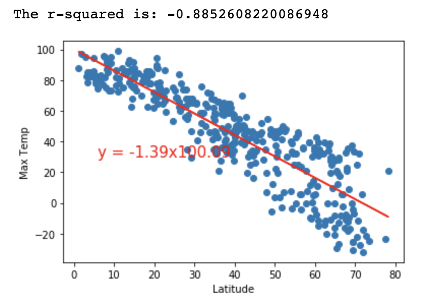
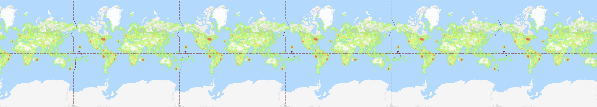

# Python API Challenge
Utilize APIs to conduct data analysis on weather

## Part 1: WeatherPy
I will create a Python script to visualize the weather of 500+ random cities across the world of varying distance from the equator. To accomplish this, I will be utilizing a simple Python library, the OpenWeatherMap API, to create a representative model of weather across world cities

### Objective #1
<b> Build a series of scatter plots to showcase latitude against the following weather attributes: </b>  

         

 

### Objective #2
Run linear regression on each relationship, only this time separating them into Northern Hemisphere (greater than or equal to 0 degrees latitude) and Southern Hemisphere (less than 0 degrees latitude):  
<b> Example: </b>  
<b>This graph shows Northern Hemisphere: Max Temp vs. Latitude Linear Regression </b>  

## Part 2: VacationPy
1. Use the analysis conducted above on weather to plan future vacations

<b> Create a heat map that displays the humidity for every city from part 1 of the homework </b>  

2. Narrow down the DataFrame to find your ideal weather condition  
For example:  
- Max temperature lower than 80 degrees but higher than 70
- Wind speed less than 10 mph
- Zero cloudiness  
** Drop any rows that don’t contain all three conditions. You want to be sure the weather is ideal  

Then use Google Places API to find the first hotel for each city located within 5000 meters of your coordinates  

Plot the hotels on top of the humidity heatmap with each pin containing the Hotel Name, City, and Country  
