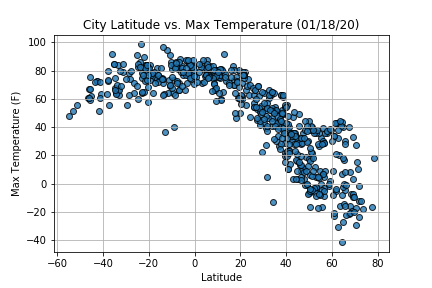
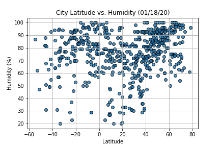
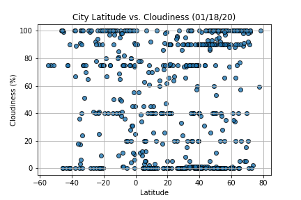
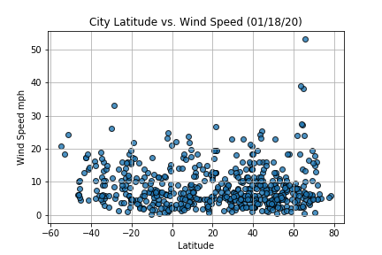

# Python API Challenge
Utilize APIs to conduct data analysis on weather

## Part 1: WeatherPy
I will create a Python script to visualize the weather of 500+ cities across the world of varying distance from the equator. To accomplish this, I will be utilizing a simple Python library, the OpenWeatherMap API, to create a representative model of weather across world cities

### Objective #1
<b> Build a series of scatter plots to showcase the following relationships: </b>  

         

 

### Objective #2
Run linear regression on each relationship, only this time separating them into Northern Hemisphere (greater than or equal to 0 degrees latitude) and Southern Hemisphere (less than 0 degrees latitude):

After each pair of plots explain what the linear regression is modelling such as any relationships you notice and any other analysis you may have.

### Goal:
- Randomly select at least 500 unique (non-repeat) cities based on latitude and longitude.
- Perform a weather check on each of the cities using a series of successive API calls.
- Include a print log of each city as it’s being processed with the city number and city name.
- Save a CSV of all retrieved data and a PNG image for each scatter plot.

