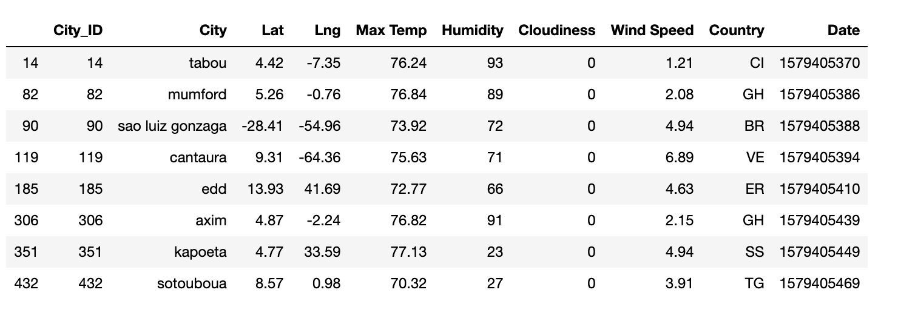
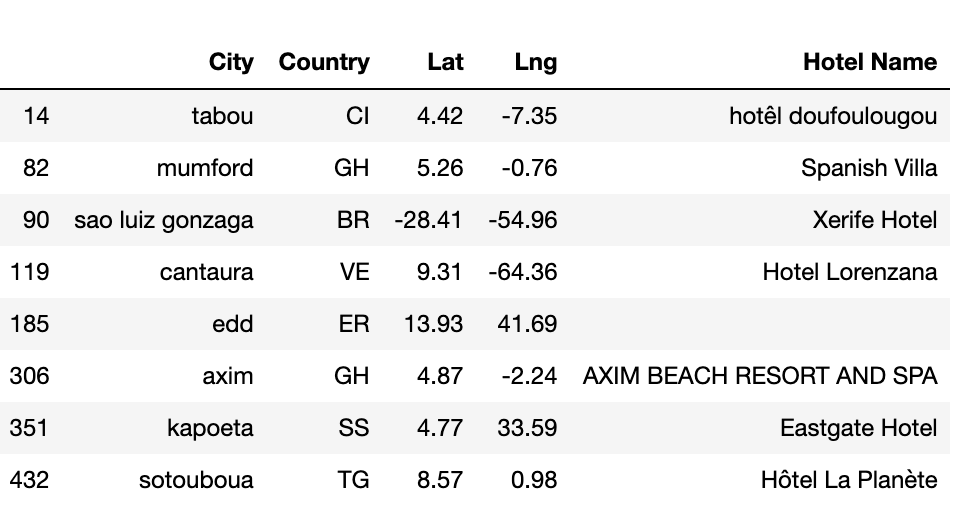
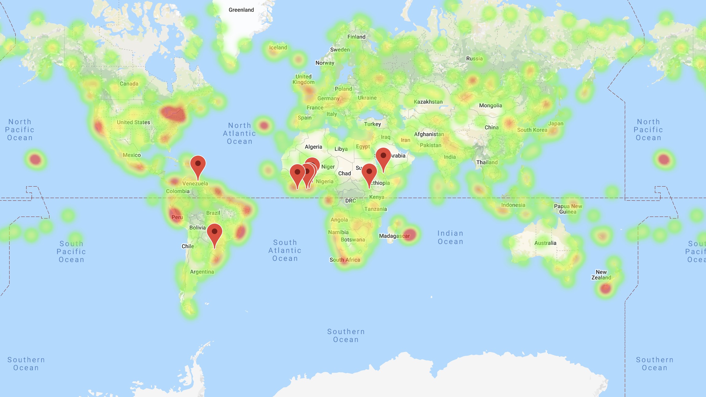

# Python API Challenge
Utilize APIs to conduct data analysis on weather

## Part 1: WeatherPy
I will create a Python script to visualize the weather of 500+ random cities across the world of varying distance from the equator. To accomplish this, I will be utilizing a simple Python library, the OpenWeatherMap API, to create a representative model of weather across world cities

### Objective #1
<b> Build a series of scatter plots to showcase latitude against the following weather attributes: </b>  

         

 

### Objective #2
Run linear regression on each relationship, only this time separating them into Northern Hemisphere (greater than or equal to 0 degrees latitude) and Southern Hemisphere (less than 0 degrees latitude):  
<b> Example: </b>  
<b>This graph shows Northern Hemisphere: Max Temp vs. Latitude Linear Regression </b>  

## Part 2: VacationPy
### Objective: Use the analysis conducted above on weather to plan future vacations

<b> 1. Create a heat map that displays the humidity for every city from part 1 of the homework </b>  

<b> 2. Narrow down the DataFrame to find your ideal weather condition to the following (all 3 conditions must be satisfied) </b>  
- Max temperature lower than 80 degrees but higher than 70
- Wind speed less than 10 mph
- Zero cloudiness  

<b> 3. Use Google Places API to find the first hotel for each city located within 5000 meters of your coordinates </b>   

<b> 4. Plot the hotels on top of the humidity heatmap with each pin containing the Hotel Name, City, and Country </b>  

